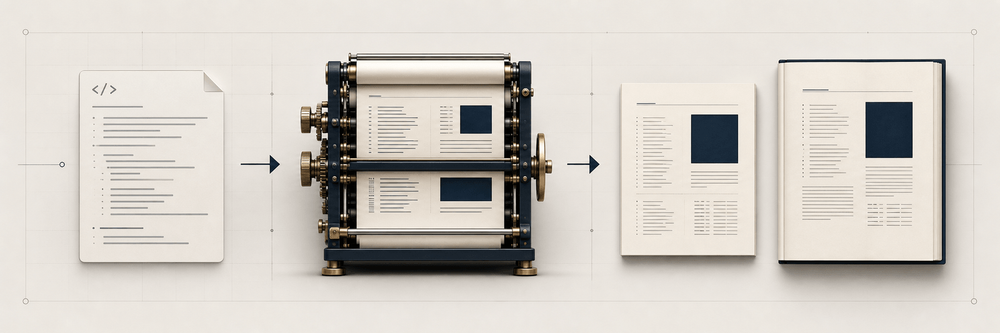
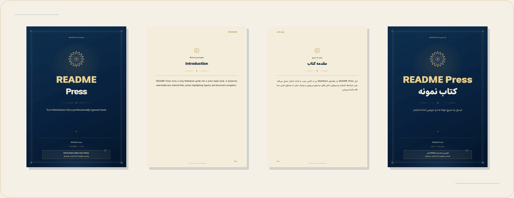

<div dir="rtl">

<p align="center">
  
</p>

<h1 align="center">معرفی README Press</h1>

<p align="center">
  <strong>همون READMEای که نگه می‌داری رو به کتاب PDF حرفه‌ای و آماده انتشار تبدیل کن.</strong>
</p>

<p align="center">
  <a href="./README.md">English</a> · <strong>فارسی</strong>
</p>

<p align="center" dir="ltr">
  <a href="https://github.com/3lf/readme-press/actions/workflows/ci.yml"></a>
  <a href="https://github.com/3lf/readme-press/releases/latest"></a>
  <a href="./LICENSE"></a>
  
</p>

<p align="center">
  <a href="#شروع-سریع">شروع سریع</a> ·
  <a href="#خروجی-واقعی-رو-ببین">نمونه‌های PDF</a> ·
  <a href="./action.yml">مرجع Action</a> ·
  <a href="https://github.com/3lf/readme-press/releases/latest">آخرین انتشار</a>
</p>

ابزار README Press برای پروژه‌هاییه که یک فایل Markdown بلند، منبع اصلی محتواشونه. متن روی GitHub خوانا و مرتب می‌مونه؛ تنظیمات صفحه، تایپوگرافی، کاور، کیفیت تصویر و بررسی‌های انتشار هم به فایل پیکربندی منتقل می‌شن.

اولین استفاده واقعی این موتور، ساخت یه کتاب فارسی و راست‌به‌چپ بود. به همین خاطر متن دوجهته، فونت محلی، ترکیب فارسی و لاتین و QA تصویری صفحه‌به‌صفحه از اول جزو هسته پروژه بودن. همین خط تولید حالا کتاب‌های چپ‌به‌راست، راست‌به‌چپ و ترکیبی رو می‌سازه.

## خروجی واقعی رو ببین

<p align="center">
  <a href="https://github.com/3lf/readme-press/releases/latest">
    
  </a>
</p>

<p align="center"><sub>این‌ها رندر واقعی خط تولید انگلیسی و فارسی هستن، نه تصویر تقریبی از خروجی.</sub></p>

| نمونه | نسخه عادی | نسخه باکیفیت |
|---|---|---|
| کتاب انگلیسی و چپ‌به‌راست | [دریافت PDF](https://github.com/3lf/readme-press/releases/latest/download/readme-press-example.pdf) | [دریافت PDF](https://github.com/3lf/readme-press/releases/latest/download/readme-press-example-high-quality.pdf) |
| کتاب فارسی و راست‌به‌چپ | [دریافت PDF](https://github.com/3lf/readme-press/releases/latest/download/readme-press-example-fa.pdf) | [دریافت PDF](https://github.com/3lf/readme-press/releases/latest/download/readme-press-example-fa-high-quality.pdf) |

## این موتور چطور کار می‌کنه؟

<table>
  <tr>
    <td width="33%"><strong>قدم اول: نوشتن Markdown</strong><br>فایل README روی GitHub مفید می‌مونه و تنها منبع محتواست.</td>
    <td width="33%"><strong>قدم دوم: تعریف کتاب</strong><br>یه فایل کوچیک، مشخصات، فصل‌ها، قالب، خروجی‌ها و بررسی‌های پروژه رو تعریف می‌کنه.</td>
    <td width="33%"><strong>قدم سوم: ساخت و انتشار</strong><br>یک پایپلاین هر دو نسخه رو می‌سازه، همه صفحه‌ها رو بررسی می‌کنه و فایل‌های انتشار رو تحویل می‌ده.</td>
  </tr>
</table>

خط تولید آماده پروژه این امکانات رو داره:

- **پردازش Markdown گیت‌هاب:** همراه با مقصدهای پایدار و سازگار با انکرهای GitHub
- **ساختار قابل تنظیم:** برای مقدمه، بخش‌ها، فصل‌ها و عمق دلخواه فهرست مطالب
- **پشتیبانی درست از متن دوجهته:** برای فارسی و بقیه زبان‌های راست‌به‌چپ، حتی وقتی فارسی و لاتین کنار هم میان
- **رندر کامل محتوا:** شامل کد با Shiki، نمودار Mermaid، ایموجی محلی، جدول، callout و تصویر
- **ناوبری کامل:** شامل bookmark، مقصد داخلی، لینک ریپو، QR code و فوتر قابل ردیابی
- **دو کیفیت از یک منبع:** نسخه عادی با تصاویر JPEG بهینه و نسخه باکیفیت با تصاویر بدون افت
- **بررسی کامل PDF:** برای ابعاد، فونت، لینک، مقصد داخلی، کیفیت تصویر، رندر همه صفحه‌ها و برابری دو نسخه
- **انتشار تکرارپذیر:** همراه با manifest، هش SHA-256 و متن کوتاه Release

قالب آماده `lapis-rtl` همراه موتور ارائه می‌شه. هر پروژه می‌تونه stylesheet، کاور، فونت و تنظیمات Mermaid خودش رو جایگزین کنه یا بدون fork کردن موتور، QA مخصوص محتوای خودش رو اضافه کنه.

## شروع سریع

یه workflow دستی به ریپویی اضافه کن که README اصلی داخلشه:

```yaml
name: Release book

on:
  workflow_dispatch:
    inputs:
      version:
        description: Release version, for example v1.0.0
        required: true
        type: string

jobs:
  book:
    runs-on: ubuntu-latest
    permissions:
      contents: read
    steps:
      - uses: actions/checkout@v7
      - uses: 3lf/readme-press@v0.1.1
        with:
          command: pipeline
          config: book/readme-press.config.mjs
          release-version: ${{ inputs.version }}
          source-commit: ${{ github.sha }}
          render-all: true
```

وقتی Action رو به یه تگ مشخص pin می‌کنی، ساخت محلی و CI از یه نسخه بررسی‌شده موتور استفاده می‌کنن. Action وابستگی‌های قفل‌شده خودش رو نصب می‌کنه، هر دو کیفیت PDF رو می‌سازه، QA عمومی و بررسی‌های مخصوص پروژه رو اجرا می‌کنه و اطلاعات Release رو آماده می‌کنه.

## کمترین تنظیمات لازم

کنار README اصلی یه فایل `readme-press.config.mjs` بساز:

```javascript
export default {
  source: "README.md",
  outputDir: "dist",
  metadata: {
    title: "My Book",
    subtitle: "A practical guide",
    author: "Example Author",
    edition: "First edition · 2026",
    language: "en",
    direction: "ltr"
  },
  repository: {
    url: "https://github.com/example/my-book"
  },
  structure: {
    introHeading: "Introduction",
    githubTocHeading: "Contents",
    parts: [
      { title: "Foundations", startHeading: "First chapter" }
    ]
  },
  outputs: {
    normal: "my-book.pdf",
    high: "my-book-high-quality.pdf"
  }
};
```

قرارداد متن عمداً ساده‌ست: یه تیتر مقدمه، یه تیتر برای فهرست دست‌نویس GitHub و تیترهای سطح یک فصل‌ها بعد از فهرست. تیتر شروع هر بخش هم ساختار نسخه چاپی رو مشخص می‌کنه.

## اجرای محلی

نسخه آزمایشی فعلی رو از npm نصب کن:

```bash
npm install --save-dev readme-press@beta
npx readme-press version
```

بعدش نسخه عادی، باکیفیت یا هر دو رو بساز:

```bash
npx readme-press build --config readme-press.config.mjs --quality normal
npx readme-press build --config readme-press.config.mjs --quality high
npx readme-press build --config readme-press.config.mjs --quality all
```

این ابزارها باید روی سیستم نصب باشن:

- **نسخه Node.js:** نسخه ۲۲ یا جدیدتر
- **ابزار qpdf:** برای ساخت PDF خطی و آماده انتشار
- **ابزارهای Poppler:** شامل `pdfinfo`، `pdffonts`، `pdftotext`، `pdfimages` و `pdftoppm`

روی Ubuntu از فرمان `sudo apt-get install -y poppler-utils qpdf` و روی macOS از `brew install poppler qpdf` استفاده کن.

ممکنه npm 11 ازت بخواد script نصب مرورگر Puppeteer رو بررسی کنی. اگه پروژه‌ات سیاست سخت‌گیرانه‌ای برای install scriptها داره، قبل از ساخت با فرمان `npm install-scripts approve puppeteer` نسخه نصب‌شده Puppeteer رو تأیید کن.

## بررسی و آماده‌سازی انتشار

برای ساخت و بررسی کامل یه commit مشخص، پایپلاین رو اجرا کن:

```bash
node .readme-press/bin/readme-press.mjs pipeline \
  --config book/readme-press.config.mjs \
  --release-version v1.0.0 \
  --commit FULL_GIT_COMMIT \
  --render-all
```

گزینه `render-all` از Poppler می‌خواد همه صفحه‌های هر دو نسخه رو رندر کنه. اگه رندر خراب باشه، تصویرها یکی نباشن، ساختار PDF ایراد داشته باشه، لینک یا فونتی گم شده باشه، صفحه‌بندی دو نسخه فرق کنه یا بررسی مخصوص پروژه شکست بخوره، QA متوقف می‌شه.

هر پروژه می‌تونه بررسی‌های مخصوص خودش رو بدون دست‌زدن به موتور اضافه کنه:

```javascript
export default defineConfig({
  // ...
  qa: {
    script: "book/qa.mjs",
    minPages: 100,
    maxPages: 400,
    fontFamilies: ["Estedad", "Vazirmatn", "JetBrainsMono"],
    extractablePhrases: ["A phrase that must remain searchable"]
  }
});
```

ماژول QA یه تابع پیش‌فرض با ورودی `{ config, manifest, check }` صادر می‌کنه. بررسی ساختار و رندر PDF باید داخل README Press بمونه؛ قواعد ویرایشی، واژه‌ها، تعداد فصل‌ها و قرارداد صفحه‌بندی مخصوص پروژه رو داخل همین ماژول بذار.

## قرارداد قالب سفارشی

قالب و کاور دلخواهت رو داخل تنظیمات انتخاب کن:

```javascript
theme: {
  directory: "book/theme",
  stylesheet: "book.css"
},
cover: {
  file: "book/theme/cover.html"
}
```

پوشه قالب می‌تونه فونت‌ها، `mermaid.config.json` و `puppeteer-ci.json` رو نگه داره. کاور باید یه عنصر با کلاس `.cover` داشته باشه. فیلدهای اختیاری `data-readme-press` هم اجازه می‌دن نام مجموعه، عنوان، زیرعنوان، نویسنده، تاریخ‌ها و نشانی ریپو به‌صورت خودکار وارد کاور بشن.

قالب داخلی فونت‌های Estedad، Vazirmatn و JetBrains Mono رو با مجوز SIL Open Font License همراه خودش داره. خود README Press هم با [مجوز MIT](./LICENSE) منتشر شده.

## مشارکت در توسعه

```bash
npm ci
npm test
npm run test:syntax
npm run test:action
npm run test:integration
npm run test:package
npm run pack:check
npm audit --audit-level=low
go run github.com/rhysd/actionlint/cmd/actionlint@v1.7.7 .github/workflows/*.yml
```

تست یکپارچه هر دو کیفیت نمونه انگلیسی و فارسی رو می‌سازه، تک‌تک صفحه‌ها رو رندر می‌کنه، ساختار PDF و لینک‌ها رو بررسی می‌کنه، پیکسل تصاویر بدون افت رو مقایسه می‌کنه و اطلاعات Release رو اعتبارسنجی می‌کنه. تست بسته هم دقیقاً همون tarball مربوط به npm رو می‌سازه، داخل یه پروژه خالی نصبش می‌کنه، وابستگی‌های سمت مصرف‌کننده رو ممیزی می‌کنه و با CLI نصب‌شده هر دو کیفیت PDF رو می‌سازه و بررسی می‌کنه.

</div>
