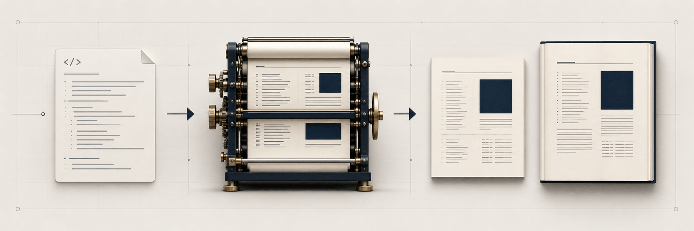
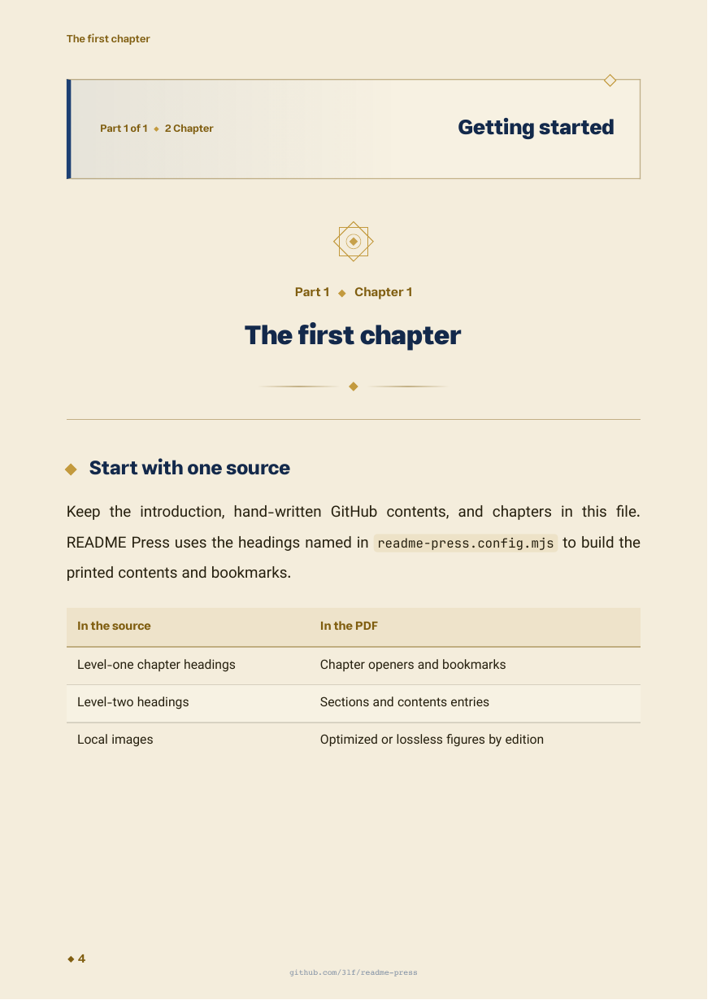

<p align="center">
  
</p>

<h1 align="center">README Press</h1>

<p align="center"><strong>Turn one book-shaped Markdown source into repeatable, checked PDF editions.</strong></p>

<p align="center"><strong>English</strong> · <a href="./README.fa.md">فارسی</a></p>

<p align="center">
  <a href="https://github.com/3lf/readme-press/actions/workflows/ci.yml"></a>
  <a href="https://github.com/3lf/readme-press/releases/latest"></a>
  <a href="./LICENSE"></a>
  
</p>

README Press is for technical authors who keep a long, structured guide in one README or Markdown file. It builds normal, print, and high-quality PDFs with a cover, generated contents, bookmarks, internal links, local fonts, and repeatable QA. Your Markdown remains the source of truth.

## Is your README book-shaped?

Check this before installing:

- It has a level-one introduction heading, then a level-one hand-written GitHub contents heading, then level-one chapter headings.
- You can name the introduction, contents, and first chapter of each part in a small config file. These names must match the source headings exactly.
- It is a guide or book that benefits from chapters and PDF pagination. A short project README with only an install section is outside the current source contract.

```text
# Introduction          <- structure.introHeading
# Contents              <- structure.githubTocHeading
# The first chapter     <- structure.parts[0].startHeading
## A section
# The second chapter
```

The [complete starter source](./examples/starter/README.md) shows this shape. It includes GitHub links in its hand-written contents; README Press builds its own PDF contents from the same headings. For more than one part, give each part a `startHeading` that matches a chapter heading.

## See a real page

<p align="center"></p>

This is one rendered page from the starter PDF. The [latest release](https://github.com/3lf/readme-press/releases/latest) also has downloadable English and Persian examples in all three editions.

## Get your first PDF

> **Before the next release:** the checked-in starter is new in this candidate. Published `readme-press@0.3.0` does not contain `examples/starter`. For a candidate trial, pack this checkout with `npm pack` and install that tarball in place of `readme-press` below, or read the [starter files](./examples/starter/) directly. The commands below are the intended npm path after the next package release.

Use an empty directory for this trial so the starter cannot replace an existing README. You need Node.js 22 or 24, Python 3, `qpdf`, and Poppler. On macOS, install the external tools with `brew install python poppler qpdf`; on Ubuntu, use `sudo apt-get install -y python3 poppler-utils qpdf`. npm installs the browser renderer and Mermaid with README Press.

```bash
mkdir starter-book && cd starter-book
npm init -y
npm install --save-dev readme-press
cp node_modules/readme-press/examples/starter/README.md ./README.md
cp node_modules/readme-press/examples/starter/readme-press.config.mjs ./readme-press.config.mjs
npx readme-press build --config readme-press.config.mjs --quality all
```

The last command creates `dist/starter-book.pdf`, `dist/starter-book-print.pdf`, and `dist/starter-book-high-quality.pdf`. Open `dist/starter-book.pdf` first. The starter's `repository.url` points to README Press as a working example; change it to your book's repository before sharing a PDF. Keep `README.md` and `readme-press.config.mjs` together when moving this pattern into your own project.

Check all pages and editions after the build:

```bash
npx readme-press qa --config readme-press.config.mjs --quality all --render-all
```

The built-in QA checks PDF structure, fonts, links, destinations, geometry, source hashes, image fidelity, edition parity, and rendered pages. Review the pages yourself before sharing a book, especially after changing content, fonts, or the theme. The [testing strategy](./docs/testing.md) describes the manual production-book visual gate.

## Choose an edition

| Edition | Use it for | Image and file-size tradeoff |
| --- | --- | --- |
| **Normal** (`starter-book.pdf`) | Everyday reading, download, and online sharing | Optimizes eligible figures as JPEG; this often saves bytes in image-rich books. |
| **Print** (`starter-book-print.pdf`) | Reviewing or printing on white paper | White page and panel backgrounds with lossless color figures. Check a sample with your printer. |
| **High-quality** (`starter-book-high-quality.pdf`) | Local display or retaining source-image detail | Full-color layout with lossless source figures; image-rich books can be larger. |

File size depends on the source images and page backgrounds; the text-only starter has no fixed smallest-to-largest order. The editions share content, pagination, links, and bookmarks. `outputs.print` is optional in a custom config. The print edition is not a claim of compliance with a particular print vendor's requirements.

## Build in GitHub Actions and download the result

Commit `README.md` and `readme-press.config.mjs` to your own repository, then add [this workflow](./examples/starter/book.yml) as `.github/workflows/book.yml`. If you used the local starter commands above, also commit `package.json` and `package-lock.json`, or deliberately ignore them. Release preparation checks for uncommitted files; `node_modules/` and `dist/` may stay untracked.

> The workflow below pins the currently published `v0.3.0` Action. That release predates the candidate English locale fixes. Before using this workflow for the next release, replace the pin in both the example and your repository with that release's reviewed tag.

```yaml
name: Build book

on:
  workflow_dispatch:

permissions:
  contents: read

jobs:
  book:
    runs-on: ubuntu-latest
    steps:
      - uses: actions/checkout@3d3c42e5aac5ba805825da76410c181273ba90b1 # v7
      - uses: 3lf/readme-press@v0.3.0
        with:
          command: pipeline
          config: readme-press.config.mjs
          release-version: v0.0.0-preview.1
          source-commit: ${{ github.sha }}
          render-all: true
      - uses: actions/upload-artifact@043fb46d1a93c77aae656e7c1c64a875d1fc6a0a # v7
        with:
          name: starter-book-pdfs
          if-no-files-found: error
          path: |
            dist/starter-book.pdf
            dist/starter-book-print.pdf
            dist/starter-book-high-quality.pdf
            dist/manifest.json
            dist/SHA256SUMS.txt
            dist/release-notes.md
```

In your repository, open **Actions > Build book > Run workflow**. When the job finishes, open that run and download **starter-book-pdfs** from **Artifacts**. The ZIP contains the PDFs and their manifest, checksums, and candidate notes. Update the pinned `3lf/readme-press` tag when you intentionally upgrade the tool.

`build` makes PDFs. `qa` checks an existing build. `pipeline` builds all configured editions, runs QA, and prepares local checksums and release notes. The example version is only a candidate label. Uploading an Actions artifact makes the files downloadable from that run; neither README Press nor this workflow publishes your GitHub or npm release.

## When the first run fails

| Message or symptom | Check |
| --- | --- |
| `README Press config not found` | Run from the directory containing `readme-press.config.mjs`, or pass its actual path to `--config`. Source and output paths are relative to that file. |
| `intro chapter not found`, `GitHub TOC heading not found`, or `part starts not found` | Match the level-one source headings exactly to `structure.introHeading`, `structure.githubTocHeading`, and each part's `startHeading`. Keep them in that order. |
| `Required tool "qpdf"` or a missing Poppler command | Install `qpdf` and Poppler, then make sure their commands are on `PATH`. Python 3 is required by QA. |
| `Chromium for Puppeteer was not found` | Run `npx puppeteer browsers install chrome` in the project and retry. If npm blocks install scripts, approve Puppeteer's browser-install script. |
| `Mermaid CLI was not found` | Reinstall the project's npm dependencies so the package's Mermaid CLI is present. |
| QA reports a source or artifact mismatch | Run `build` again after changing the source or render inputs, then rerun `qa`. |

## Scope and further use

The bundled `lapis-rtl` theme handles English LTR, Persian RTL, and mixed-script books. You can supply local CSS, cover, fonts, Mermaid settings, and project-specific QA through the config. Local image files must stay inside the configured `projectRoot` (the source directory by default), including after symlinks are resolved. The [programmatic API](./docs/programmatic-api.md), [0.3 migration guide](./docs/migration-0.3.md), [testing strategy](./docs/testing.md), [security policy](./SECURITY.md), and [contribution guide](./CONTRIBUTING.md) cover advanced use.

The cover is rasterized: its visible title is in PDF metadata and body pages, but ordinary cover-page text extraction does not recover that title. README Press does not claim PDF/UA or screen-reader conformance. It does not convert arbitrary short project READMEs, publish releases for consumers, or guarantee print-vendor acceptance.

For development in this repository, run `npm ci`, then `npm run verify:publish` and the workflow lint command in [the testing strategy](./docs/testing.md). The bundled fonts use the SIL Open Font License; README Press uses the [MIT License](./LICENSE).
