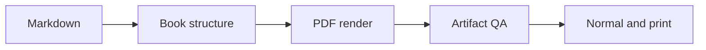

<div dir="ltr">

# Introduction

This compact book is a layout fixture. It keeps the same structured Markdown contract as a real README while placing long headings, diagrams, tables, figures, and mixed scripts near page boundaries. The source remains readable on GitHub.

## Reading the fixture

Read the printed contents before the chapters. Follow a chapter link, then use the page header and PDF bookmark to return. The same content runs through normal, print, and high-quality output.

## What a passing build means

A passing build confirms that the PDF container and configured assertions are intact. It does not prove that every page looks good. Review the rendered pages when typography or pagination changes.

# Contents

- [Introduction](#introduction)
- [From source to pages](#from-source-to-pages-when-one-readme-becomes-a-book)
- [Designing stable page breaks](#designing-stable-page-breaks)
- [Preserving technical material](#preserving-technical-material)
- [Checking rendered editions](#checking-rendered-editions)
- [Delivering a verified artifact](#delivering-a-verified-artifact)

# From source to pages when one README becomes a book

## A long heading tests line wrapping and navigation across the contents

A book-shaped source has an introduction, a hand-written GitHub contents section, and chapter headings. This chapter opens the first part and establishes a readable body page after a dense printed contents. The hierarchy should remain clear when the heading wraps.

The Markdown owns words, links, and figures. The configuration owns the trim, labels, output names, and checks. Authors can review the same content in a browser before generating a PDF.

The [next validation chapter](#checking-rendered-editions) should be an internal PDF destination. The [reference specification](https://example.org/specification) remains an external link. Both should survive all editions.

## A figure beside ordinary prose

The figure below is intentionally wide enough to reveal image degradation. Its border and label make scaling errors easy to see. A normal edition may optimize its pixels; the print and high-quality editions should keep the source pixels.


A caption-like paragraph follows the image. It should not collide with the figure, and the next heading should not be stranded at the foot of a page.

## A small diagram near a chapter boundary

The diagram has short labels so a broken SVG cache or missing embedded font is visible without relying on a large network asset.



The diagram and the following line should remain legible together. A cache hit must produce the same diagram as a fresh render for the same inputs.

## An end-of-chapter checklist

The diagram may move to a new page when it cannot fit beside its heading. The continuation should still have enough context to read as part of this chapter, rather than looking like an isolated image.

- Confirm the figure border is complete and its label is sharp.
- Confirm every Mermaid node and arrow is present.
- Confirm the internal chapter link still points to a destination.
- Confirm the following page begins with a clear chapter opener.

These checks belong beside the generated artifact. The source alone cannot show whether a line, image, or heading crossed a page boundary cleanly.

# Designing stable page breaks

## A chapter opener after a part transition

A chapter opener must be distinct from an ordinary section heading. The previous chapter deliberately combines a wide figure and diagram so the renderer must place this transition without clipping or leaving an accidental blank page.

The margin above a heading is useful only when the heading still appears with the paragraph it introduces. This paragraph gives the visual review a clear first line to compare.

## A long code block that may cross a page

The next block exceeds the short-code threshold. Line numbers are part of its content, making a missing line or a repeated line easy to detect after pagination.

```text
01 receive the Markdown source
02 validate the configured introduction
03 locate the hand-written contents
04 collect the first chapter
05 apply part boundaries
06 preserve inline links
07 keep the author image path
08 resolve the local image
09 record the original image bytes
10 inspect the diagram source
11 load the Mermaid configuration
12 embed the diagram font
13 write the chapter heading
14 write the section heading
15 keep this line with its neighbors
16 place the page break if required
17 continue the block on the next page
18 preserve every visible line
19 retain syntax and punctuation
20 prepare the normal edition
21 prepare the print edition
22 prepare the high-quality edition
23 check the resulting page count
24 inspect the actual PDF metadata
25 verify internal destinations
26 verify external links
27 compare page images manually
28 record the release evidence
```

The paragraph after the code block must have normal body styling. It must not be absorbed into the shaded code panel or separated by an unexplained blank page.

## An ordinary body paragraph near the next break

Repeatable pagination depends on the font files and CSS bytes as well as the Markdown. The fixture uses enough material to expose a page boundary, while staying short enough to inspect every page during development.

# Preserving technical material

## A table with a repeating header

This table crosses the long-table threshold. Review its header, borders, row order, and continuation if the renderer breaks it over a page.

| Stage | Input | Expected result |
|---|---|---|
| 01 | Source | Introduction selected |
| 02 | Contents | GitHub list omitted from print |
| 03 | Chapter | Bookmark created |
| 04 | Section | Destination created |
| 05 | Code | Lines preserved |
| 06 | Image | Source path resolved |
| 07 | Diagram | SVG rendered |
| 08 | Link | URI retained |
| 09 | Metadata | Title written |
| 10 | Footer | Page numeral selected |
| 11 | Normal | Figure optimized |
| 12 | Print | White page palette |
| 13 | High | Lossless figure retained |
| 14 | QA | All pages rasterized |
| 15 | Release | Checksums prepared |

The final row should stay distinct from the following prose. If a page break falls inside the table, the result must remain readable in both the printed page and extracted text.

## Mixed RTL and LTR text

A technical sentence can mix فارسی with `README Press`, `v0.3.0`, and an expression such as `[2, 6, 512]`. The Persian words should remain in logical order while the code-like tokens stay left-to-right.

### Reading a Persian phrase with an English version

در این نمونه، مقدار `v0.3.0` کنار متن فارسی می‌آید تا جهت نمایش در متن، فهرست و صفحه بررسی شود. The following English sentence resumes the document's LTR base direction.

## The last section before the next part

This paragraph closes the first part. It gives the next part transition a real preceding page with table and mixed-script content, rather than an empty synthetic spacer.

# Checking rendered editions

## Compare normal, print, and high-quality output

The print edition should use a white paper palette. The high-quality edition should retain lossless figure pixels. The normal edition uses JPEG optimization for the fixture image; file size also depends on the image content. All three should have matching text and navigation.

A cover image can look excellent while its title is absent from extracted text. The PDF title metadata is separate from the cover pixels. This fixture checks both surfaces without claiming accessibility conformance.

## Inspect the difficult page

A code continuation, the long table, and mixed-script prose are the pages most likely to reveal a spacing regression. A page renderer succeeding is necessary, but a person still needs to check the actual page image.

## Verify navigation and text

Searchable display headings matter for copying and indexing. An exact extracted phrase assertion guards against known Poppler spacing failures. External links and named destinations provide separate evidence for navigation.

The repository link appears on the cover and in the colophon. The external reference appears in the first chapter. A click should lead to the intended HTTP address, while the internal link should stay inside the PDF.

The printed contents also contains destinations for chapters and sections. Its page numbers should point to the same pages that carry those headings, even when a code block or table continues over a break.

### Check copied text

Copy a display heading and a line from the long code block. Compare their spaces and punctuation with the Markdown source. A viewer may differ from Poppler, so record the extractor used for any failure report.

For mixed-script text, inspect visual order and extracted logical order separately. A readable page does not prove that copied Persian and English tokens remain in the intended sequence.

# Delivering a verified artifact

## Keep the output inventory honest

Each configured PDF has a distinct filename, size, and checksum. The manifest should describe the artifacts produced by this build, not an older render from a different source or theme.

## Review before publication

This fixture is an automated companion to the production-book visual gate. It is not a substitute for comparing a full real book page by page with the approved baseline.

</div>
